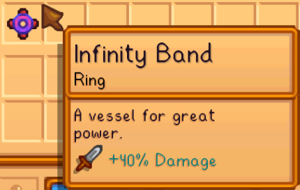
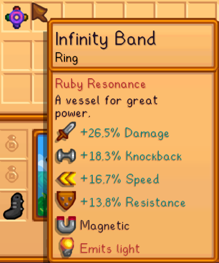



# Gemstone Harmonics

## What This Is

This mod replaces the boring and overpowered vanilla Iridium Band with a more interesting alternative based on real Music Theory and somewhat inspired by the MCU Infinity Gauntlet. It was born initially to fix the "supremacy" of the Iridium Band, which very quickly made all other rings redundant, which turn also pigeon-holes all players into simple flat-damage builds. I wanted to create a system that promoted build diversity, and it hit me when I noticed that the Iridium Band is clearly depicted with 4 gemstones.

The new system is complex, but I've tried my best to make the description below easy to understand while also being educational. My hope is that the new mechanic will encourage experimentation, enable build-crafting, and also teach some basic Music Theory.

## The Infinity Band

Initially, a newly crafted Iridium Band will grant no effects at all; it's merely an ordinary band made of iridium. Only with access to the Forge will you be able to awaken its true form, by infusing it with a single Galaxy Soul, transforming it into an **Infinity Band**.

<figure align="center" id="fig1">
  
</figure>

The Infinity Band likewise does nothing on its own, but it serves as a vessel for up to 4 gemstones of your choice. To add a gemstone to the Infinity Band, you must fuse it with a corresponding gemstone ring at the Forge. The same type of gemstone can be added more than once, compounding the effect. Alternatively, combining different gemstones may lead to powerful [resonances](#garnet--gemstone-resonance-theory).

The Infinity Band cannot be combined with any non-gemstone ring. In most cases, this means that players will now be forced to choose between power and utility, and to strategically carry different types of rings for different situations.

## Garnet & Gemstone Resonance Theory

Compensating for the removal of the vanilla Acrobat profession when using [Walk Of Life](../Professions), this mod introduces a seventh gemstone, the **Garnet**, which can be mined upwards of Mine level 80. Socketed to a ring or a weapon, it will grant 10% cooldown reduction to special moves.

With the addition of Garnet, the seven gemstones together form a [Diatonic Scale](https://en.wikipedia.org/wiki/Diatonic_scale), with each gemstone functioning as a musical note:

<figure align="center" id="fig1">
  
</figure>

 

<i>The Diatonic Gemstone Scale. The dashed lines show examples of Tertian Tetrad chords rooted in Ruby (red), Aquamarine (blue) and Emerald (green).</i>

 

Beginning at the top, the scale progresses clockwise and is cyclic; i.e., after **Rb** comes **Aq**, **Am**, and so on until **Tp**, before again repeating **Rb**.

### Intervals

Like strings in a guitar, each gemstone has a characteristic vibration. When two gemstones are placed side-by-side, these vibrations overlap, causing [interference](https://en.wikipedia.org/wiki/Wave_interference) patterns that can be constructive or destructive. In other words, certain gemstone pairs may amplify each other's vibrations, while others may instead dampen each other.

A pair of gemstones forms an [Interval](https://en.wikipedia.org/wiki/Interval_(music)). As the name implies, this is simply the distance between the two gemstones in the Diatonic Scale. A distance of 1 is known as a **Second** interval (e.g., `Rb->Aq`), a distance of 2 is known as a **Third** interval (e.g., `Aq->Ga`), and so on. One full rotation of the circle is called an [Octave](https://en.wikipedia.org/wiki/Octave), or [Unison](https://en.wikipedia.org/wiki/Unison) (an interval of zero), denoting the interval between a gemstone and itself.

Notice that, because the scale is cyclic, intervals always come in pairs; for instance, the **Sixth** interval `Rb->Jd` is always accompanied by the **Third** interval `Jd->Rb`. Likewise for any **Second** and **Seventh**, and every **Fourth** and **Fifth**. These intervals are complementary, and effectively equivalent. You can obtain one by simply counting backwards from the other (i.e., `Rb->Jd` is a **Sixth**, but written backwards `Jd<-Rb` it becomes a **Third**.

As a rule of thumb, stones that are positioned farthest from each other in the scale will resonate more strongly, while those positioned really close to each other may dissonate. All complementary intervals generate the same resonance, with the exception of the Fifth and Fourth (this is due to some over-simplifications from real-life Music Theory). Gemstones do not resonate with themselves.

| Interval | Resonance | Examples |
| -------- | --------- | -------- |
| Second   | -12.5%    | `Rb->Aq` `Am->Ga` `Ga->Em` |
| Third    | 16.6%     | `Rb->Am` `Am->Em` `Ga->Jd` |
| Fourth   | 33.3%     | `Rb->Ga` `Am->Jd` `Ga->Tp` |
| Fifth    | 50%       | `Rb->Em` `Am->Tp` `Ga->Rb` |
| Sixth    | 16.6%     | `Rb->Jd` `Am->Rb` `Ga->Aq` |
| Seventh  | -12.5%*   | `Rb->Tp` `Am->Aq` `Ga->Am` |
| Octave   | 0         | `Rb->Rb` `Am->Am` `Ga->Ga` |

It should be clear that the **Fifth** is the strongest-resonating interval, for which reason it is known as the **Dominant** interval. The **Fourth**, its complement, is known as the **Sub-dominant**.

### Chords

When multiple gemstones are placed together, the complex superposition of resonances that results from all possible interval permutations is called a [Chord](https://en.wikipedia.org/wiki/Chord_(music)). Gemstones can only interact in very close proximity, which means that chords may only be formed by up to 4 gemstones placed together in the same Infinity Band; the chords from different Infinity Bands do not interact.

The gemstone with the highest amplitude in a chord becomes the **Tonic**, or **Root**. This will determine the "flavor" of the chord. All chords with a prominent Root will emit light of a corresponding color and amplitude.

Chords have also an associated **Richness**, which measures how "interesting" it sounds. A higher richness is achieved by more complex chords (i.e., avoiding repeated gemstones). Some sufficiently rich chords can also exhibit **magnetism**.

In case it wasn't clear, **the order in which gemstones are placed in the ring does not matter.**

#### Monad Chords

A 1-note chord is called a **Monad**. A Monad is the simplest possible chord; it is made by simply repeating the same gemstone up to 4 times. Because it only contains Unisons, this chord offers no resonances and zero richness. As a result, it does not emit light, but achieves the highest single-stat total of any chord. The Ruby Monad is shown below.

#### Dyad Chords

A 2-note chord is called a **Dyad**. A Dyad always contains exactly 2 complementary intervals. Given the table above, it should be clear that the best possible Dyad is the one made from the **Dominant** interval; i.e., a `I->V` configuration, such as `Rb->Em`. This chord contains the intervals Fifth and Fourth (from the inverse, `Em->Rb`), resulting in a +50% resonance to Rb and +33.3% to Em. A "double" `I->V->I->V` chord is called a [Power Chord](https://en.wikipedia.org/wiki/Power_chord); the simplest resonating chord (and a staple of rock music). The Ruby Power Chord is shown below.

Compared to the simple Monad, the Power Chord Dyad exchanges some of the primary stat for a substantial boost to the secondary stat.

On the other hand, a `I->II` configuration Dyad, like `Aq->Am`, would contain the intervals Second and Seventh (from the inverse, `Am->Aq`), resulting in a strong dissonance, and a dampening of both gemstones (i.e., avoid this!).

#### Triad Chords

A 3-note chord is called a **Triad**. A Triad always contains 6 intervals. There are many possible Triad combinations, but only one that avoids dissonances: the [Tertian](https://en.wikipedia.org/wiki/Tertian). A Tertian chord is formed by stacking sequential Third intervals. Notice that the Third of a Third is simply a Fifth (look at the wheel above to convince yourself of this). This means that a Tertian Triad is actually the configuration `I->III->V`.
The Ruby Tertian Triad is shown below.

Notice also that, due to the cyclic nature of the scale, the `I->III->V` configuration is equivalent to a "shifted" `I->IV->VI`. Take for instance the example of `Em->Rb->Am`, which is a `I->IV->VI` configuration; if we shift all notes one position to the left, then the chord becomes `Rb->Am->Em`, which is a `I->III->V` configuration. The shifting around of notes is known as [Transposition](https://en.wikipedia.org/wiki/Transposition_(music)). This does not change the chord, but allows us to see it from a different perspective.

#### Tetrad Chords

Finally, a 4-note chord is called a **Tetrad**. A Tetrad always contains 12 intervals in total, which makes it impossible find a configuration that avoids any dissonances. But this is okay; if we extend the Tertian Triad by adding another Third interval at the end, we achieve a **Tertian Tetrad**, or `I->III->V->VII` (the `VII` is the Third of the `V`). In this special case, the dissonant Seventh interval becomes resonant, adding +12.5% resonance instead of subtracting it. The Tertian Tetrad achieves the highest possible total resonance, though it forcefully spreads out those bonuses among 4 different stats. The Ruby Tertian Tetrad is shown below.

For the same reason described previously, the configuration `I->II->IV->VI` is equivalent to a transposed Tertian Tetrad.

|  |  |  |  |
|--------------------------------|-----------------------------------|-----------------------------------|-----------------------------------|
| **Figure 1: The Ruby Monad** | **Figure 2: The Ruby Power Chord** | **Figure 3: The Ruby Tertian Triad** | **Figure 4: The Ruby Tertian Tetrad** |

Of course, you are not limited to just the configurations shown abnove; the system will adapt to any configuration you attempt to use. Take these configurations as suggestions for those who simply desire a template.

There is no "best" configuration; the trade-off is always between maximizing a single or a few stats, versus maximizing the total amount of bonuses from resonances. As you increase a chord's complexity and richness, you essentially trade higher specific stats, for higher overall distributed stats. This system is intended to encourage experimentation and variety. It is up to each player to choose what best fits their desired build.

### Weapon Resonance

If the player's currently held weapon contains forged gemstones, they may also resonate with equiped Infinity Bands. But in this case, the resonance is far simpler; forged gemstones do not make up their own Chords, but will be amplified if they match the Root note of any equipped Chords. Intuitively, you can think of it as forged gemstones individually being too far apart to resonate with each other, but the emergent resonance from the Chords in your wielding hand is strong enough to vibrate through the blade.

## Craftable Gemstone Rings

This mod will optionally add Combat skill recipes for all Gemstone rings, requiring the corresponding gemstone and a type of metal bar:

| Ring       | Ingredient | Combat Level |
| ---------- | ---------- | ------------ |
| Amethyst   | Copper Bar | 2 |
| Topaz      | Copper Bar | 2 |
| Aquamarine | Iron Bar   | 4 |
| Jade       | Iron Bar   | 4 |
| Ruby       | Gold Bar   | 6 |
| Emerald    | Gold Bar   | 6 |
| Garnet     | Gold Bar   | 7 |

This is accompanied by visual changes to each ring to match the color of the required metal bar. The visual change is compatible with [Better Rings](https://www.nexusmods.com/stardewvalley/mods/8642) and [Vanilla Tweaks](https://www.nexusmods.com/stardewvalley/mods/10852). Other visual overhauls of rings will be incompatible.

Note that crafting is the only way to obtain the Garnet Ring, and therefore disabling this option will make that ring unobtainable.

## Compatibility

Compatible with [Better Rings](https://www.nexusmods.com/stardewvalley/mods/8642) and [Vanilla Tweaks](https://www.nexusmods.com/stardewvalley/mods/10852).
Incompatible with other ring re-texture mods.

## Credits & Special Thanks

Credits to the following translators:
